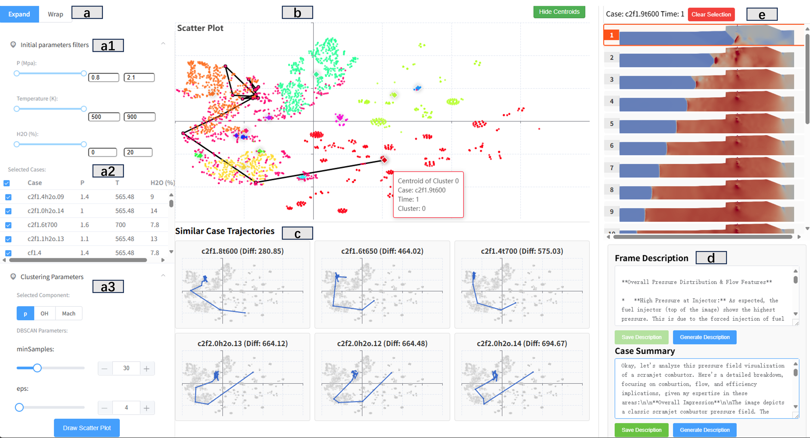

# TemporalFlowViz: Parameter-Aware Visual Analytics for Interpreting Scramjet Combustion Evolution

## Demo Video

[Watch the Demo Video](https://youtu.be/W0qQ9eYFXVs)

## System Interface



The visual analytics system interface of *TemporalFlowViz*:

* (a) *Filtering Panel* presents initial parameters filters, case selection table and clustering parameters.
* (b) *Temporal Trajectory View* visualizes the clustering result and temporal trajectory of the selected case in latent space.
* (c) *Similar Trajectories View* draws the top three most similar temporal trajectories of three simulation cases.
* (d) *Report View* shows the AI generated or expert annotated description of selected frame in (b).
* (e) *Details View* displays all the flow field frames of the same case of selected point in (b).

## Project setup

Put your corresponding flow field images at `frontend/public/external_images`. Then, edit `path_prefixes` in `backend/flaskserver.py` to match your directories.

Put your npy files (embeddings and filenames of the flow field images) at `backend/npys`.

You can install the Ollama and your favorite vision language model, and change the `OLLAMA_MODEL_NAME` in `backend/flaskserver.py` to the name of your model.

```
# Create environment from file
conda env create -f environment.yml

# Activate the environment
conda activate temporalflowviz

# Start the Flask server
cd backend
python flaskserver.py

# install dependencies for the frontend
cd ../frontend
npm install
npm run serve
```

### Compiles and minifies for production

```
npm run build
```
